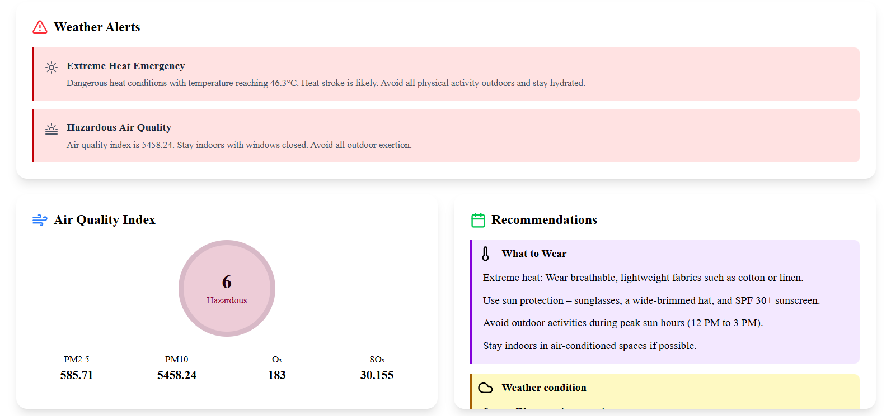
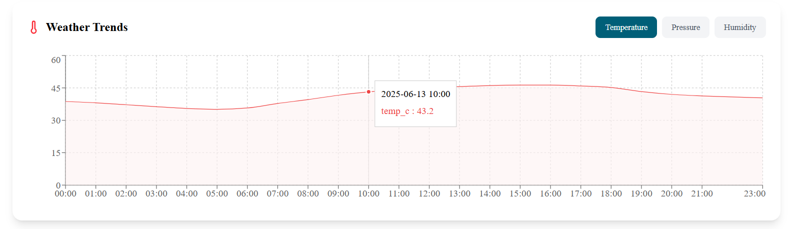
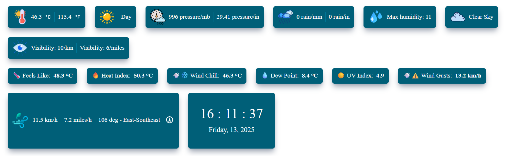
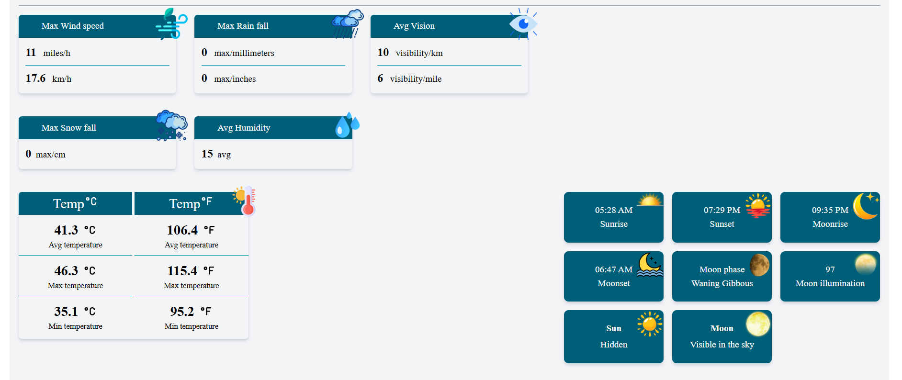
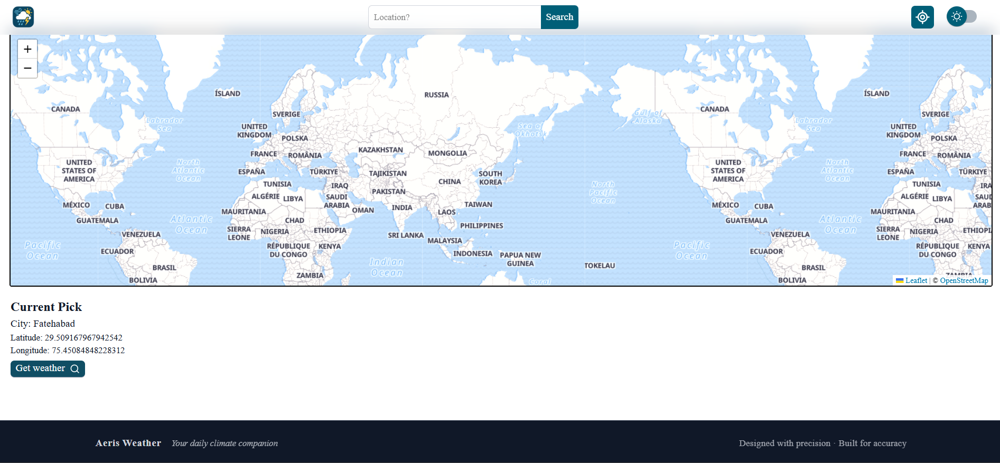
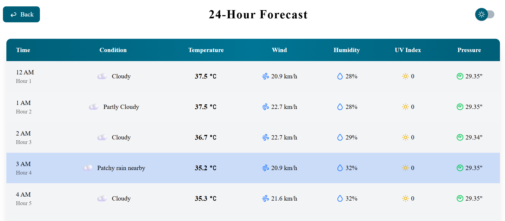
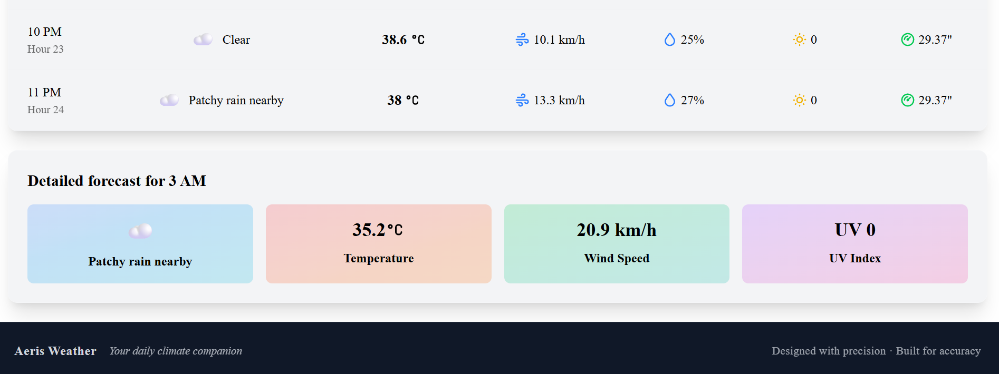

**📦 Aeris Weather**

A sleek, modern weather application that provides detailed insights—including alerts, air quality, forecasts, and hourly breakdowns—based on user-selected locations via an interactive map.

**🚀 Live Demo**

(Add link if deployed)

**📸 Screenshots**

1. Alerts & Air Quality

Highlights urgent alerts (e.g. Extreme Heat, Hazardous Air Quality).

Displays the Air Quality Index (AQI) with PM2.5, PM10, O₃, SO₃ metrics.

Includes tailored recommendations on what to wear and precautions.

---

2. Weather Trends

Toggle between Temperature, Pressure, and Humidity trends.

Interactive chart showing hourly data (e.g. reaching 43.2 °C at 10 AM).

---

3. Quick Stats & Live Time

Cards for temperature, pressure, rain, humidity, visibility, feels-like temperature, etc.

Real-time clock displaying current time and date.

---

4. Detailed Daily Metrics

Summarized daily values: max wind speed, precipitation, visibility, humidity, temperature stats, sunrise/sunset/moon phases.

---

5. Map & Location Selection

Full-width interactive Leaflet map with search and location markers.

Shows selected coordinates and city.

“Get weather” button fetches data for chosen location.

---
 
6. 24-Hour Forecast

Hourly forecast listing with icons, temperature, wind, humidity, UV, and pressure.

Highlights current hour.

Detailed card view for selected hour—weather conditions, temperature, wind speed, UV index.

---

**💡 Key Features**

Interactive Map Picker for custom location selection.

Real-time Weather Alerts and Air Quality Index analysis.

Hourly & Daily Forecasts with interactive trend charts.

Rich Data Cards summarizing temperature, pressure, humidity, visibility, and more.

Custom Recommendations based on current conditions (e.g., heat precautions, clothing advice).

Dark Mode Support and responsive design across devices.

**🛠 Tech Stack**

| Category           | Technologies                    |
|--------------------|---------------------------------|
| UI                 | React, Tailwind CSS             |
| Routing            | React-Router-DOM                |
| State Management   | React Redux                     |
| Maps               | Leaflet.js, OpenStreetMap       |
| Charts             | Recharts                        |
| Data Sources       | Weather API                     |
| Icons & Assets     | Lucide React / Custom Assets    |
